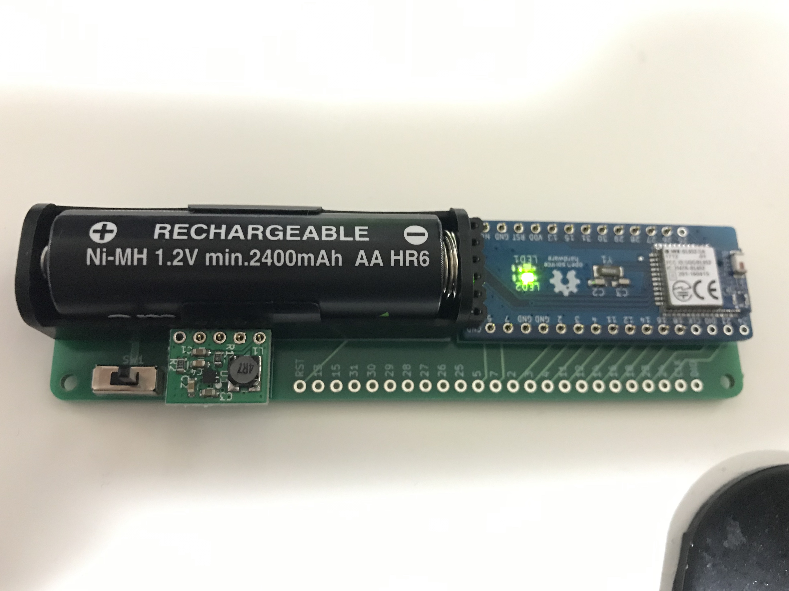

# BL652-breakout-extender

[BL652-breakout](https://github.com/ogatatsu/BL652-breakout)を単3電池1本で動作させるための拡張基板。

## 部品

| Name | Description | Manufacturer
----|----|----
| U1 | TPS610986_Module | https://www.switch-science.com/catalog/3659/ |
| SW1 | Slide Switch, SS-12D00-G5| Zhejiang Jianfu Electronics Co., Ltd |
| BT1 | Battery Holder, BH-311-1P24| COMFORTABLE ELECTRONIC CO., LTD |

## License

https://creativecommons.org/licenses/by/4.0/
